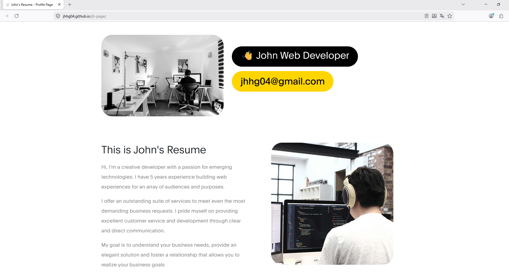

# 🚀 Developer Portfolio

This is my personal developer portfolio, showcasing my experience in software development, cloud technologies, automation, and modern web solutions.

## 🌐 Live Demo
👉 https://jhhg04.github.io/jh-page/

---

## 🧠 About This Project

This project demonstrates how to build and deploy a modern static website while applying development and DevOps best practices.

It includes:
- Responsive web design
- Version control with Git and GitHub
- Cloud-based hosting with GitHub Pages
- Clean and maintainable code structure

---

## ⚙️ Technologies Used

- HTML5 / CSS3 / JavaScript
- Git & GitHub
- GitHub Pages

---

## 🔄 Features

This project is deployed using GitHub Pages.

- Responsive portfolio website
- Project showcase section
- Contact and social links
- Easy deployment workflow
